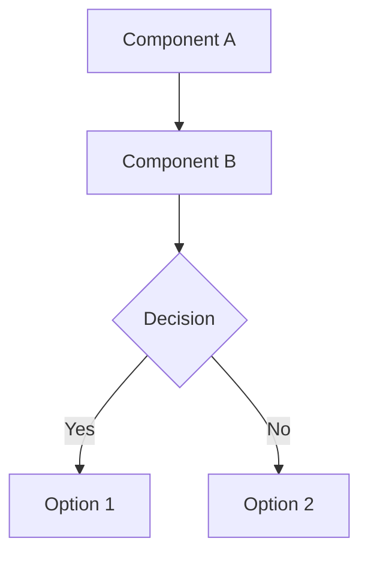
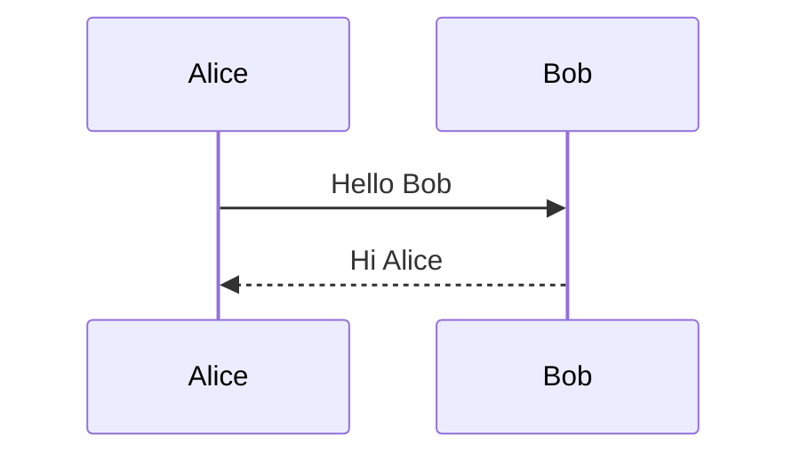

# Architecture Diagrams

This folder contains interactive Mermaid diagrams for the Automated Forecast Pipeline system.

## Available Diagrams

### 1. System Architecture (`architecture.md`)
**Purpose**: Shows the complete system architecture with all components and their relationships.

**Includes**:
- External data sources (CHIRPS, NASA POWER, ERA5, NDVI, Ocean Indices)
- Pipeline services (Scheduler, Orchestrator, Ingestion Manager, etc.)
- Data layer (PostgreSQL, Redis)
- Monitoring stack (Prometheus, Grafana)
- Outputs (Forecasts, Recommendations, Triggers)

**Best for**: Understanding overall system design and component relationships.

### 2. Component Interaction Sequence (`sequence.md`)
**Purpose**: Shows the detailed step-by-step interaction between components during pipeline execution.

**Includes**:
- Execution trigger flow
- Lock acquisition
- Incremental ingestion loop
- Forecast generation
- Recommendation creation
- Metrics recording
- Alert delivery

**Best for**: Understanding execution flow and component interactions.

### 3. Data Flow (`dataflow.md`)
**Purpose**: Shows how data flows through the system from ingestion to outputs.

**Includes**:
- Data sources
- Ingestion stages (fetch, validate, transform)
- Database storage
- Processing stages (feature engineering, model inference, post-processing)
- Outputs (forecasts, recommendations, triggers, alerts)

**Best for**: Understanding data transformation and processing pipeline.

## Viewing the Diagrams

### Option 1: GitHub/GitLab
Simply open the `.md` files in GitHub or GitLab - Mermaid diagrams render automatically.

### Option 2: VS Code
1. Install the "Markdown Preview Mermaid Support" extension
2. Open any diagram file
3. Press `Ctrl+Shift+V` (or `Cmd+Shift+V` on Mac) to preview

### Option 3: Mermaid Live Editor
1. Go to https://mermaid.live/
2. Copy the Mermaid code from any diagram file
3. Paste into the editor
4. View and export as PNG/SVG

### Option 4: Documentation Sites
If using MkDocs, Docusaurus, or similar:
1. Install Mermaid plugin for your documentation tool
2. Include the diagram files in your documentation
3. Diagrams will render automatically

## ASCII Versions

For environments that don't support Mermaid rendering, ASCII art versions of all diagrams are available in the main documentation:

**File**: `docs/AUTOMATED_PIPELINE_GUIDE.md`

**Sections**:
- System Architecture Diagram (ASCII)
- Component Interaction Diagram (ASCII)
- Data Flow Diagram (ASCII)

## Exporting Diagrams

### Export as PNG/SVG

**Using Mermaid CLI**:
```bash
# Install Mermaid CLI
npm install -g @mermaid-js/mermaid-cli

# Export as PNG
mmdc -i architecture.md -o architecture.png

# Export as SVG
mmdc -i architecture.md -o architecture.svg
```

**Using Mermaid Live Editor**:
1. Open https://mermaid.live/
2. Paste diagram code
3. Click "Actions" → "PNG" or "SVG"
4. Download the image

### Export as PDF

**Using Mermaid CLI**:
```bash
mmdc -i architecture.md -o architecture.pdf
```

**Using Browser**:
1. Open diagram in Mermaid Live Editor
2. Use browser's "Print to PDF" function

## Editing Diagrams

### Mermaid Syntax

Mermaid uses simple text-based syntax. Here are the basics:

**Graph/Flowchart**:


**Sequence Diagram**:


**Full Documentation**: https://mermaid.js.org/intro/

### Best Practices

1. **Keep it simple**: Don't overcrowd diagrams
2. **Use subgraphs**: Group related components
3. **Add descriptions**: Include notes and labels
4. **Use colors**: Style important components
5. **Test rendering**: Verify in multiple viewers

## Updating Diagrams

When updating the system architecture:

1. **Update Mermaid diagrams** in this folder
2. **Update ASCII diagrams** in `docs/AUTOMATED_PIPELINE_GUIDE.md`
3. **Update descriptions** in both locations
4. **Export new images** if needed
5. **Commit all changes** together

## Related Documentation

- **Main Guide**: `docs/AUTOMATED_PIPELINE_GUIDE.md`
- **Deployment**: `docs/DOCKER_DEPLOYMENT.md`
- **Monitoring**: `docs/MONITORING_SETUP.md`
- **Testing**: `docs/TEST_IMPLEMENTATION_COMPLETE.md`

## Questions?

For questions about the diagrams or architecture:
- Check the main documentation: `docs/AUTOMATED_PIPELINE_GUIDE.md`
- Review the design spec: `.kiro/specs/automated-forecast-pipeline/design.md`
- Contact the development team
