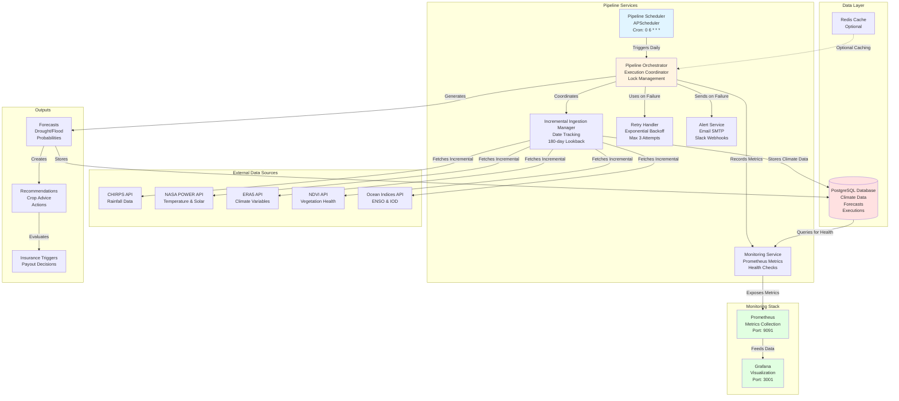

# System Architecture Diagram

This diagram shows the complete system architecture with all components and their interactions.

## Mermaid Diagram

## Component Descriptions

### External Data Sources
- **CHIRPS**: Climate Hazards Group InfraRed Precipitation with Station data
- **NASA POWER**: Prediction Of Worldwide Energy Resources
- **ERA5**: ECMWF Reanalysis v5
- **NDVI**: Normalized Difference Vegetation Index
- **Ocean Indices**: El Niño Southern Oscillation (ENSO) and Indian Ocean Dipole (IOD)

### Pipeline Services
- **Scheduler**: Manages automated daily execution at 06:00 UTC
- **Orchestrator**: Coordinates all pipeline stages and handles errors
- **Ingestion Manager**: Tracks last ingestion dates and calculates incremental ranges
- **Retry Handler**: Implements exponential backoff for transient failures
- **Alert Service**: Sends notifications via email and Slack
- **Monitoring Service**: Exposes Prometheus metrics and health checks

### Data Layer
- **PostgreSQL**: Primary data store for climate data, forecasts, and execution metadata
- **Redis**: Optional caching layer for performance optimization

### Monitoring Stack
- **Prometheus**: Collects and stores time-series metrics
- **Grafana**: Provides visualization dashboards

### Outputs
- **Forecasts**: Drought and flood predictions with probabilities
- **Recommendations**: Agricultural advice based on forecasts
- **Triggers**: Insurance payout decisions based on thresholds

## Viewing This Diagram

This Mermaid diagram will render automatically in:
- GitHub/GitLab markdown viewers
- VS Code with Mermaid extension
- Documentation sites (MkDocs, Docusaurus, etc.)
- Mermaid Live Editor: https://mermaid.live/

For ASCII version, see main documentation: `docs/AUTOMATED_PIPELINE_GUIDE.md`
