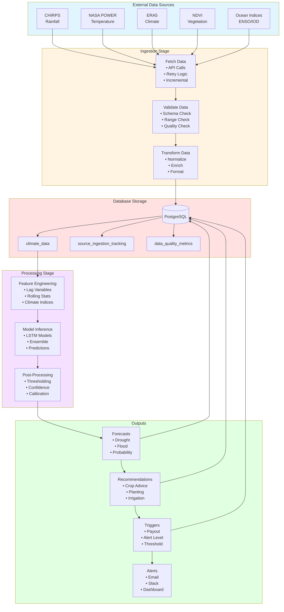

# Data Flow Diagram

This diagram shows how data flows through the system from ingestion to outputs.

## Mermaid Data Flow Diagram

## Detailed Data Flow

### Stage 1: Data Sources
**Input**: External climate data APIs

**Sources**:
- **CHIRPS**: Daily rainfall data (mm)
- **NASA POWER**: Temperature (°C), solar radiation (W/m²)
- **ERA5**: Comprehensive climate variables (temperature, pressure, humidity, wind)
- **NDVI**: Vegetation health indices (0-1 scale)
- **Ocean Indices**: ENSO (Niño 3.4), IOD indices

**Output**: Raw climate data in various formats (JSON, NetCDF, CSV)

### Stage 2: Ingestion
**Input**: Raw climate data from APIs

**Sub-stages**:

1. **Fetch Data**
   - Makes API calls with date ranges
   - Implements retry logic (3 attempts, exponential backoff)
   - Fetches only incremental data (since last ingestion)
   - Handles rate limiting and timeouts

2. **Validate Data**
   - Schema validation (required fields present)
   - Range validation (values within expected bounds)
   - Quality checks (missing data, outliers)
   - Logs validation errors

3. **Transform Data**
   - Normalizes to common format
   - Enriches with metadata (source, timestamp)
   - Converts units if needed
   - Formats for database storage

**Output**: Validated, transformed climate data ready for storage

### Stage 3: Database Storage
**Input**: Transformed climate data

**Tables**:

1. **climate_data**
   - Columns: date, location_lat, location_lon, temperature_avg, rainfall, ndvi, etc.
   - Indexed by: date, location
   - Partitioned by: date (monthly)

2. **source_ingestion_tracking**
   - Columns: source, last_successful_date, updated_at
   - Tracks last ingestion per source

3. **data_quality_metrics**
   - Columns: execution_id, source, records_validated, records_failed, validation_errors
   - Tracks quality metrics per execution

**Output**: Persisted climate data available for processing

### Stage 4: Processing
**Input**: Climate data from database

**Sub-stages**:

1. **Feature Engineering**
   - Creates lag variables (t-1, t-7, t-30 days)
   - Calculates rolling statistics (7-day, 30-day means)
   - Computes climate indices (SPI, SPEI)
   - Generates interaction features

2. **Model Inference**
   - Loads trained LSTM models
   - Runs ensemble predictions
   - Generates probability distributions
   - Produces forecast horizons (1, 3, 6 months)

3. **Post-Processing**
   - Applies probability thresholds
   - Calculates confidence intervals
   - Calibrates predictions
   - Formats output

**Output**: Forecast predictions with probabilities

### Stage 5: Outputs
**Input**: Forecast predictions

**Output Types**:

1. **Forecasts**
   - Drought probability (0-1)
   - Flood probability (0-1)
   - Forecast horizon (months)
   - Confidence level
   - Target date

2. **Recommendations**
   - Crop selection advice
   - Planting date recommendations
   - Irrigation scheduling
   - Risk mitigation actions

3. **Insurance Triggers**
   - Payout decisions (yes/no)
   - Alert levels (green/yellow/red)
   - Threshold exceedance
   - Payout amounts

4. **Alerts**
   - Email notifications
   - Slack messages
   - Dashboard updates
   - SMS (future)

**Storage**: All outputs stored in database for historical tracking

## Data Volumes

### Typical Daily Ingestion
- CHIRPS: ~365 records (1 per day per location)
- NASA POWER: ~365 records
- ERA5: ~365 records
- NDVI: ~12 records (monthly)
- Ocean Indices: ~1 record (monthly)
- **Total**: ~1,100 records/day

### Typical Daily Outputs
- Forecasts: ~50 forecasts (multiple horizons, locations)
- Recommendations: ~50 recommendations
- Triggers: ~10 trigger evaluations
- **Total**: ~110 output records/day

### Database Growth
- Climate data: ~400 KB/day
- Forecasts: ~50 KB/day
- Execution metadata: ~10 KB/day
- **Total**: ~460 KB/day (~168 MB/year)

## Data Quality Checks

### Ingestion Stage
- ✓ Required fields present
- ✓ Values within expected ranges
- ✓ No duplicate records
- ✓ Timestamps valid
- ✓ Coordinates valid

### Processing Stage
- ✓ Sufficient historical data
- ✓ No excessive missing values
- ✓ Feature distributions normal
- ✓ Model predictions reasonable
- ✓ Confidence levels appropriate

### Output Stage
- ✓ Probabilities between 0-1
- ✓ Dates in future
- ✓ Recommendations actionable
- ✓ Triggers properly evaluated

## Viewing This Diagram

This Mermaid diagram will render automatically in:
- GitHub/GitLab markdown viewers
- VS Code with Mermaid extension
- Documentation sites (MkDocs, Docusaurus, etc.)
- Mermaid Live Editor: https://mermaid.live/

For ASCII version, see main documentation: `docs/AUTOMATED_PIPELINE_GUIDE.md`
