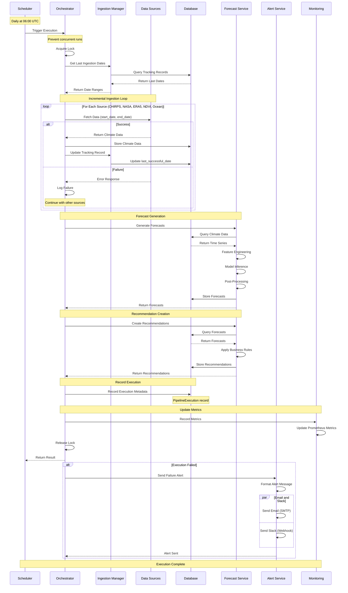

# Component Interaction Sequence Diagram

This diagram shows the detailed interaction between components during a pipeline execution.

## Mermaid Sequence Diagram

## Execution Flow Steps

### 1. Trigger (Scheduler → Orchestrator)
- Scheduler triggers execution at configured time (default: 06:00 UTC)
- Can also be triggered manually via CLI

### 2. Lock Acquisition (Orchestrator)
- Acquires database advisory lock
- Prevents concurrent pipeline executions
- Returns error if lock already held

### 3. Get Last Ingestion Dates (Orchestrator → Ingestion Manager)
- Queries `source_ingestion_tracking` table
- Returns last successful ingestion date per source
- Uses 180-day lookback if no previous data

### 4. Incremental Ingestion Loop (Orchestrator → Data Sources)
- For each data source (CHIRPS, NASA POWER, ERA5, NDVI, Ocean Indices):
  - Fetches data for calculated date range
  - Stores data in database
  - Updates tracking record
  - Continues even if individual source fails (graceful degradation)

### 5. Forecast Generation (Orchestrator → Forecast Service)
- Queries climate data from database
- Performs feature engineering
- Runs ML model inference
- Post-processes predictions
- Stores forecasts in database

### 6. Recommendation Creation (Orchestrator → Forecast Service)
- Queries forecasts from database
- Applies business rules
- Generates agricultural recommendations
- Stores recommendations in database

### 7. Record Execution (Orchestrator → Database)
- Records execution metadata:
  - Status (completed/failed/partial)
  - Duration
  - Records stored
  - Forecasts generated
  - Sources succeeded/failed
  - Error messages (if any)

### 8. Update Metrics (Orchestrator → Monitoring)
- Records execution metrics
- Updates Prometheus counters and gauges
- Updates health status

### 9. Release Lock (Orchestrator)
- Releases database advisory lock
- Allows next execution to proceed

### 10. Send Alerts (Orchestrator → Alert Service)
- Only triggered on failure
- Sends email via SMTP
- Sends Slack message via webhook
- Includes error details and context

## Error Handling

### Retry Logic
- Data source failures: 3 attempts with exponential backoff (2s, 4s, 8s)
- Forecast failures: 1 retry after 5 minutes
- Logs all retry attempts

### Graceful Degradation
- Pipeline continues if some sources fail
- Generates forecasts with available data
- Marks execution as 'partial' if any source fails
- Tracks which sources succeeded/failed

### Alert Conditions
- Complete pipeline failure
- All data sources fail
- Forecast generation fails
- Data/forecasts become stale (>7 days)

## Viewing This Diagram

This Mermaid diagram will render automatically in:
- GitHub/GitLab markdown viewers
- VS Code with Mermaid extension
- Documentation sites (MkDocs, Docusaurus, etc.)
- Mermaid Live Editor: https://mermaid.live/

For ASCII version, see main documentation: `docs/AUTOMATED_PIPELINE_GUIDE.md`
